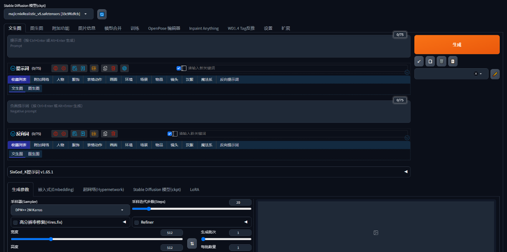

# Stable Diffusion WebUI In Docker


### 一、基础环境要求
- 操作系统：Ubuntu 20.04 LTS 服务器或桌面版
- CUDA：>=12.1
- 其它：安装docker、nvidia-docker2

  ( https://github.com/AUTOMATIC1111/stable-diffusion-webui )


### 二、构建anaconda3镜像
```shell
docker build -t anaconda3:2023.03-1 .
```


### 三、构建webui（stable-diffusion-webui）镜像
#### 1、提前下载`torch-2.1.2+cu121-cp310-cp310-linux_x86_64.whl`包到torch目录下，加速镜像构建，命令：
```shell
curl -o torch-2.1.2+cu121-cp310-cp310-linux_x86_64.whl -O https://download.pytorch.org/whl/cu121/torch-2.1.2%2Bcu121-cp310-cp310-linux_x86_64.whl
```

#### 2、构建webui镜像：
```shell
docker build -t webui:1.9.4 .
```
```shell
注意，构建过程中如果出现问题，请编辑Dockerfile添加以下配置，开启加速：
RUN set -x \
        && export HTTP_PROXY="http://x.x.x.x:1080" \                    # 添加此项
        && export HTTPS_PROXY="http://x.x.x.x:1080" \                   # 添加此项
        && export NO_PROXY="localhost,127.0.0.1" \                      # 添加此项
        && cd ~ \
        && . anaconda3/etc/profile.d/conda.sh \
        ...
```


### 四、扩展webui插件
```shell
docker build -t webui .
```


### 五、上传模型
#### 1、运行容器：
```shell
./start.sh
```

#### 2、上传模型到`models/Stable-diffusion/`目录下：
```shell
# ls -lh models/Stable-diffusion/
total 2.3G
-rwxr-xr-x 1 root root 2.3G Jun  6 15:36 majicmixRealistic_v6.safetensors
```


### 六、访问stable-diffusion-webui
#### 1、启动stable-diffusion-webui：
```shell
docker exec -it webui bash
cd stable-diffusion-webui
./start.sh
```

#### 2、通过浏览器访问`http://x.x.x.x:7860`打开`stable-diffusion-webui`界面：



