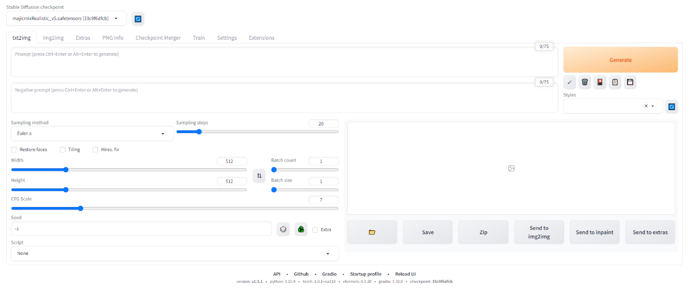

### Stable Diffusion WebUI in Docker
#### 1、构建anaconda3镜像：
```shell
docker build -t anaconda3:2023.03-1 .
```

#### 2、下载`torch-2.0.1+cu118-cp310-cp310-linux_x86_64.whl`包到torch目录下，加速镜像构建，下载命令：
```shell
curl -O https://download.pytorch.org/whl/cu118/torch-2.0.1%2Bcu118-cp310-cp310-linux_x86_64.whl
```

#### 3、构建webui镜像：
```shell
docker build -t webui .
```
```shell
注意，打包过程中如果出现问题，请编辑Dockerfile使用加速：
RUN set -x \
        ...
        && python -m venv venv \
        && . venv/bin/activate \
        && export HTTP_PROXY="http://x.x.x.x:1080" \
        && export HTTPS_PROXY="http://x.x.x.x:1080" \
        && export NO_PROXY="localhost,127.0.0.0" \
        && pip install --upgrade pip \
        ...
```

#### 4、运行容器：
```shell
./start.sh
```

#### 5、上传模型到`models/Stable-diffusion/`目录下：
```shell
ls models/Stable-diffusion/
 majicmixRealistic_v5.safetensors
```

#### 6、启动
```shell
docker exec -it webui bash
cd stable-diffusion-webui/
./webui.sh --xformers --listen
```

#### 7、通过浏览器访问`http://x.x.x.x:7890`打开界面：



